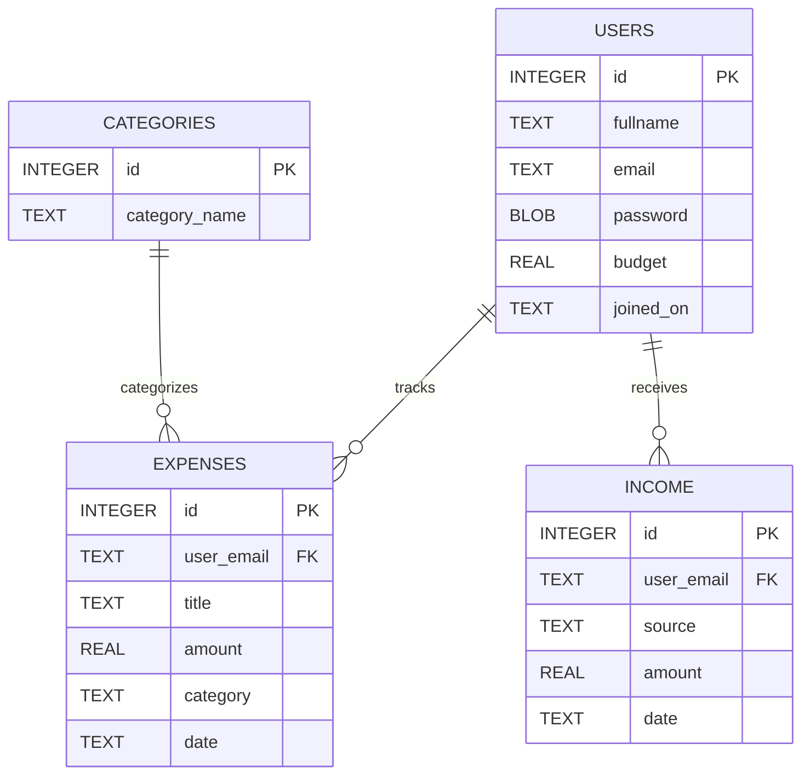

  
  # 🗄️ Database Architecture – ETRACKER
  
  

    <b>ETRACKER uses SQLite to securely manage user accounts, expenses, income tracking, and spending categories.</b>
  

  

---

## 🏗️ Entity-Relationship Diagram

---

## 🗂️ Database Tables

### 👤 1. Users Table
Stores registered user information, login credentials, and budget settings.

| Field Name | Type | Description |
| :--- | :--- | :--- |
| `id` | `INTEGER` | Unique User ID *(Primary Key)* |
| `fullname` | `TEXT` | Full name of the user |
| `email` | `TEXT` | Unique email address |
| `password` | `BLOB` | Encrypted password using bcrypt |
| `budget` | `REAL` | Monthly spending budget |
| `joined_on` | `TEXT` | Account registration date |

### 💸 2. Expenses Table
Stores all user expense records and spending history.

| Field Name | Type | Description |
| :--- | :--- | :--- |
| `id` | `INTEGER` | Unique Expense ID *(Primary Key)* |
| `user_email` | `TEXT` | Connected user email |
| `title` | `TEXT` | Expense title/name |
| `amount` | `REAL` | Expense amount |
| `category` | `TEXT` | Expense category |
| `date` | `TEXT` | Expense date |

### 💰 3. Income Table
Stores income or balance added by the user.

| Field Name | Type | Description |
| :--- | :--- | :--- |
| `id` | `INTEGER` | Unique Income ID *(Primary Key)* |
| `user_email` | `TEXT` | Connected user email |
| `source` | `TEXT` | Income source |
| `amount` | `REAL` | Income amount |
| `date` | `TEXT` | Income added date |

### 🏷️ 4. Categories Table
Stores predefined expense categories used throughout the application.

| Field Name | Type | Description |
| :--- | :--- | :--- |
| `id` | `INTEGER` | Category ID *(Primary Key)* |
| `category_name`| `TEXT` | Name of expense category |

---
